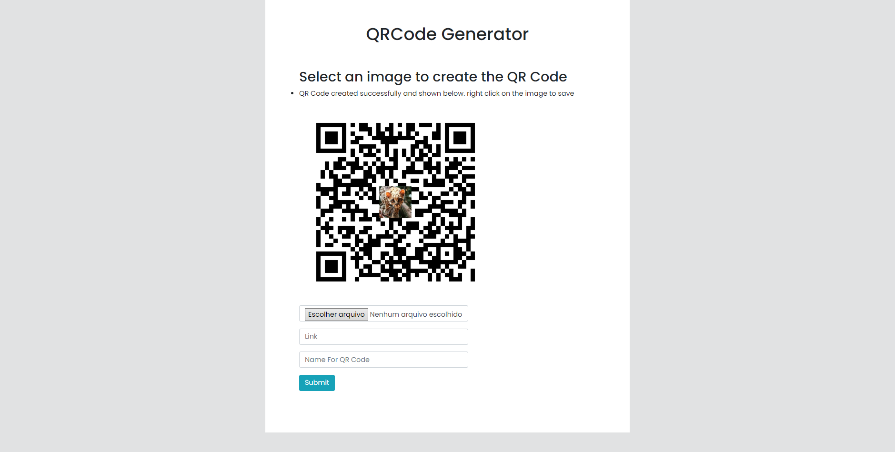

<h1 align="center">
  🌐️<br>QRコード
</h1>

*Read this in other languages: [Portuguese](readme.pt.md), [English](readme.md), [한국어](readme.ko.md), [简体中文](readme.zh-cn.md), [正體中文](readme.zh-tw.md).*

<h4 align="center">
  Pythonで作成され、FlaskにロードされたQRコードジェネレーター。
</h4>

<p align="center"></p>

<h4 align="center"><a href="https://webqrcodegeneratorreserve.herokuapp.com">クリックしてプロジェクトを表示</a></h4>
<h4 align="center"><a href="https://github.com/JordanCampos20/QRCode/archive/refs/heads/main.zip">クリックしてプロジェクトをダウンロード</a></h4>

---

## インストール
```
git clone https://github.com/JordanCampos20/QRCode.git
```
```
pip install -r requirements.txt
```

```
python2とpython3を使用している場合は、requirements.txtをダウンロードするときにpip3を使用してください
```

## ランニング

```
「main.py」ファイルを実行すると、localhost：5000でサイトが起動します。
```

---

## 💼 使用するテクノロジー
このアプリケーションの開発には、次のテクノロジを使用しました。

Python 3.x、HTML、CSS、JS;

---

## 📚 中古ライブラリ
このアプリケーションの開発には、次のライブラリを使用しました。

- Flask==2.1.1, Pillow==9.1.0, qrcode==7.3.1, Werkzeug==2.1.1, gunicorn==20.1.0;

---

## 🦄 著者<br>
<table>
  <tr>
    <td align="center">
      <a href="https://github.com/JordanCampos20">
        <br>
        <sub>
          <b>Jordan C.</b>
        </sub>
      </a>
    </td>
  </tr>
</table>

---