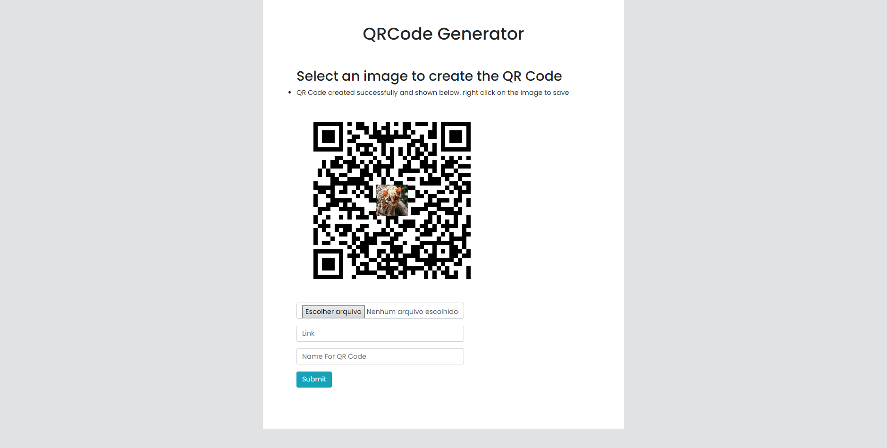

<h1 align="center">
  🌐️<br>QR 코드
</h1>

*Read this in other languages: [Portuguese](readme.pt.md), [English](readme.md), [日本語](readme.ja.md), [简体中文](readme.zh-cn.md), [正體中文](readme.zh-tw.md).*

<h4 align="center">
  Python으로 만들고 Flask에 로드된 QR 코드 생성기.
</h4>

<p align="center"></p>

<h4 align="center"><a href="https://webqrcodegeneratorreserve.herokuapp.com">프로젝트를 보려면 클릭하십시오</a></h4>
<h4 align="center"><a href="https://github.com/JordanCampos20/QRCode/archive/refs/heads/main.zip">프로젝트 다운로드 클릭</a></h4>

---

## 설치
```
자식 클론 https://github.com/JordanCampos20/QRCode.git
```

```
핍 설치 -r 요구 사항.txt
```

```
python2 및 python3이 있는 경우 requirements.txt를 다운로드할 때 pip3을 사용하세요.
```

## 달리기

```
"main.py" 파일을 실행하면 localhost:5000에서 사이트가 시작됩니다.
```

---

## 💼 사용된 기술
이 응용 프로그램의 개발을 위해 다음 기술을 사용했습니다:

- 파이썬 3.x, HTML, CSS, JS;

---

## 📚 중고 라이브러리
이 응용 프로그램의 개발을 위해 다음 라이브러리를 사용했습니다:

- 플라스크==2.1.1, 베개==9.1.0, qrcode==7.3.1, Werkzeug==2.1.1, gunicorn==20.1.0;

---

## 🦄 작가<br>
<table>
  <tr>
    <td align="center">
      <a href="https://github.com/JordanCampos20">
        <br>
        <sub>
          <b>Jordan C.</b>
        </sub>
      </a>
    </td>
  </tr>
</table>

---